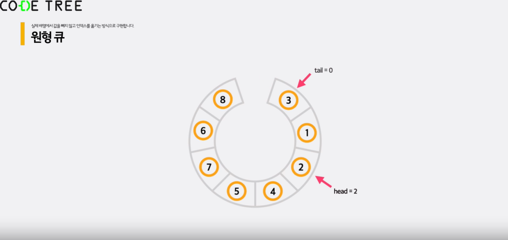

# 큐

## 기본 개념

- FIFO (선입선출) 자료구조
- 함수
  - push(x) : 큐 맨 뒤에 추가
  - size() : 요소 개수 반환
  - empty() : 요소 없으면 true, 있으면 false
  - front() : 맨앞 숫자 반환 (제거X)
  - pop() : 맨앞 숫자 반환 (제거O)
- 삭제와 삽입 시간복잡도 O(1)
- 배열을 활용하여 큐를 구현할 경우, 맨 앞에서 삽입 / 삭제를 할 때 시간복잡도가 O(N)이 된다.
- 따라서 큐는 배열보다 **연결리스트**를 활용하는 것이 적절하다. (모든 연산 O(1))
- 응용
  - 일자로 줄 서는 경우
  - 원형 구조
- JS에서 queue를 class로 구현

```js
class Queue {
  constructor() {
    // 빈 큐 하나를 생성합니다.
    this.q = [];
  }

  push(item) {
    // 큐의 맨 뒤에 데이터를 추가합니다.
    this.q.push(item);
  }

  empty() {
    // 큐가 비어있으면 true를 반환합니다.
    return this.q.length === 0;
  }

  size() {
    // 큐에 들어있는 데이터 수를 반환합니다.
    return this.q.length;
  }

  pop() {
    // 큐의 맨 앞에 있는 데이터를 반환하고 제거합니다.
    if (this.empty()) {
      throw new Error("Queue is empty");
    }
    return this.q.shift();
  }

  front() {
    // 큐의 맨 앞에 있는 데이터를 제거하지 않고 반환합니다.
    if (this.empty()) {
      throw new Error("Queue is empty");
    }
    return this.q[0];
  }
}

const q = new Queue(); // 정수를 관리할 queue를 선언합니다. => 빈 큐
q.push(3);
q.push(5);
q.push(9);

console.log(q.front()); // 가장 앞에 있는 원소를 출력합니다. => 3
q.pop(); // 가장 앞에 있는 원소를 제거합니다.
console.log(q.size()); // 원소의 개수를 출력합니다 => 2
while (!q.empty()) {
  // 가장 앞에 있는 원소부터 순서대로 출력합니다.
  console.log(q.front()); // 순서대로 5 9 출력됩니다.
  q.pop(); // 가장 앞에 있는 원소를 제거합니다.
}
```

그러나 앞서 이야기한 것처럼 큐를 이렇게 배열로 구현할 경우 pop할 때 O(n)의 시간복잡도가 걸린다.
따라서 연결리스트로 구현해야 한다.

- 연결리스트로 구현한 JS 큐

```js
class Node {
  constructor(value) {
    this.value = value;
    this.next = null;
    this.prev = null;
  }
}

class Queue {
  constructor() {
    // 빈 큐 하나를 생성합니다.
    this.count = 0;
    this.head = null;
    this.tail = null;
  }

  push(item) {
    // 큐의 맨 뒤에 데이터를 추가합니다.
    let x = new Node(item);

    if (this.count === 0) {
      // 큐가 비어있다면 head와 tail을 모두 x로 설정합니다.
      this.head = x;
      this.tail = x;
    } else {
      // 큐에 기존 값이 있다면 tail을 x로 변경합니다.
      this.tail.next = x;
      x.prev = this.tail;
      this.tail = x;
    }
    this.count++; // 큐의 크기를 1 증가시킵니다.
  }

  empty() {
    // 큐가 비어있으면 True를 반환합니다.
    return this.count === 0;
  }

  size() {
    // 큐에 들어있는 데이터 수를 반환합니다.
    return this.count;
  }

  pop() {
    // 큐의 맨 앞에 있는 데이터를 반환하고 제거합니다.
    if (this.empty()) {
      throw new Error("Queue is empty");
    }
    let x = this.head;
    if (this.count === 1) {
      this.head = null;
      this.tail = null;
    } else {
      this.head = x.next;
      this.head.prev = null;
    }
    this.count--;
    return x.value;
  }

  front() {
    // 큐의 맨 앞에 있는 데이터를 제거하지 않고 반환합니다.
    if (this.empty()) {
      throw new Error("Queue is empty");
    }
    return this.head.value;
  }
}
```

그러나 위의 방법도 매번 구현하기엔 다소 복잡한데, 시간복잡도 O(1)은 유지하면서 배열로 더 간단히 구현할 수 있는 방법이 있다.

- 배열로 선형 큐 구현하기

```js
class Queue {
  constructor() {
    // 빈 큐 하나를 생성합니다.
    this.q = [];
    this.head = -1; // head는 큐의 가장 첫 원소의 위치 바로 앞을 가리킵니다.
    this.tail = -1; // tail은 큐의 가장 마지막 원소의 위치를 가리킵니다.
  }

  push(item) {
    // 큐의 맨 뒤에 데이터를 추가합니다.
    this.q.push(item);
    this.tail++;
  }

  empty() {
    // 큐가 비어있으면 true를 반환합니다.
    return this.head === this.tail;
  }

  size() {
    // 큐에 들어있는 데이터 수를 반환합니다.
    return this.tail - this.head;
  }

  pop() {
    // 큐의 맨 앞에 있는 데이터를 반환하고 제거합니다.
    if (this.empty()) {
      throw new Error("Queue is empty");
    }
    return this.q[++this.head];
  }

  front() {
    // 큐의 맨 앞에 있는 데이터를 제거하지 않고 반환합니다.
    if (this.empty()) {
      throw new Error("Queue is empty");
    }
    return this.q[this.head + 1];
  }
}
```

이렇게 앞의 요소를 제거할 때 실제로 배열 요소를 제거하는 것이 아니라, 메모리에는 남겨두되 head의 index를 이동시켜 우리가 바라보는 큐의 영역만 좁히는 식으로 구현할 수 있다.

그러나 이 방법은 가장 간단한 대신 한계점이 있는데, 제거할 때 실제로 메모리에 저장된 요소를 제거하는게 아니기 때문에 공간복잡도가 높다는 단점이 있다.

또 이 한계점을 극복하고자 하는 방법이 **원형 큐** 이다.
head 인덱스보다 작은 인덱스들, 즉 요소를 제거했지만 메모리상으로는 남아있는 영역을 재활용하면 메모리를 절약할 수 있다.



- 배열로 원형 큐 구현하기

```js
const MAX_SIZE = 10000;

class Queue {
  constructor() {
    // 빈 큐 하나를 생성합니다.
    this.q = Array(MAX_SIZE).fill(0);
    this.head = 0;
    this.tail = 0;
  }

  push(item) {
    // 큐의 맨 뒤에 데이터를 추가합니다.
    if (this.full()) throw new Error("Queue is full");

    this.tail = (this.tail + 1) % MAX_SIZE;
    this.q[this.tail] = item;
  }

  full() {
    // 큐가 가득 차 있으면 true를 반환합니다.
    return (this.tail + 1) % MAX_SIZE === this.head;
  }

  empty() {
    // 큐가 비어있으면 true를 반환합니다.
    return this.head === this.tail;
  }

  size() {
    // 큐에 들어있는 데이터 수를 반환합니다.
    return (this.tail - this.head + MAX_SIZE) % MAX_SIZE;
  }

  pop() {
    // 큐의 맨 앞에 있는 데이터를 반환하고 제거합니다.
    if (this.empty()) throw new Error("Queue is empty");

    this.head = (this.head + 1) % MAX_SIZE;
    return this.q[this.head];
  }

  front() {
    // 큐의 맨 앞에 있는 데이터를 제거하지 않고 반환합니다.
    if (this.empty()) throw new Error("Queue is empty");

    return this.q[(this.head + 1) % MAX_SIZE];
  }
}
```

유의점 : 원형 큐인 만큼, 사용할 메모리 크기를 정해야 한다.

---

## 연습문제

### [스택 vs 큐](https://www.codetree.ai/missions/6/problems/stack-versus-queue?&utm_source=clipboard&utm_medium=text)

- 연결리스트를 이용하면 스택, 큐 모두 기존의 시간복잡도를 유지하는 함수를 구현할 수 있다.
- 스택은 LIFO를 만족하며, 큐는 FIFO를 만족한다.
- 스택은 데이터가 들어오고 나가는 위치가 동일하지만, 큐는 그렇지 않다.

### [원형 순열에서의 인원 제거](https://www.codetree.ai/missions/6/problems/josephus-permutations?&utm_source=clipboard&utm_medium=text)

```js
const MAX = 5000;
class Queue {
  constructor() {
    this.q = Array(MAX).fill(0);
    this.head = 0;
    this.tail = 0;
  }
  empty() {
    return this.head === this.tail;
  }
  full() {
    return (this.tail + 1) % MAX === this.head;
  }
  push(v) {
    if (this.full()) throw new Error("Full!");
    this.tail = (this.tail + 1) % MAX;
    this.q[this.tail] = v;
  }
  pop() {
    if (this.empty()) throw new Error("Empty!");
    this.head = (this.head + 1) % MAX;
    return this.q[this.head];
  }
  front() {
    if (this.empty()) throw new Error("Empty!");
    return this.q[(this.head + 1) % MAX];
  }
}

let answer = "";
const fs = require("fs");
const [n, k] = fs
  .readFileSync(0)
  .toString()
  .trim()
  .split(" ")
  .map((v) => +v); // 문자열로 받은 input을 숫자로 변환
const queue = new Queue();

// 1~n까지 원형 큐에 넣기
for (i = 1; i <= n; i++) {
  queue.push(i);
}

while (!queue.empty()) {
  let count = k - 1;
  while (count--) {
    // k번째 수까지 이동(k-1칸 이동)
    const temp = queue.pop();
    queue.push(temp);
  }
  answer += `${queue.pop()} `;
}

console.log(answer);
```

---

## 테스트

### [큐 연습](https://www.codetree.ai/missions/6/problems/queue-practice?&utm_source=clipboard&utm_medium=text)

```js
function solution()
    set q = empty queue
    q.push(10)  // 10
    q.push(15)  // 10 15
    q.push(35)  // 10 15 35
    q.push(40)  // 10 15 35 40
    q.pop() // 15 35 40
    q.push(20)  // 15 35 40 20
    q.pop() // 35 40 20
    q.pop() // 40 20
    q.pop() // 20
    q.push(20)  // 20 20
    q.push(15)  // 20 20 15

    set result = q.size() // 3
    result += q.pop() // 3 +20
    result += q.pop() // 23 +20
    if q.empty() == true  //false
        result *= 2

    return result // 43
```
